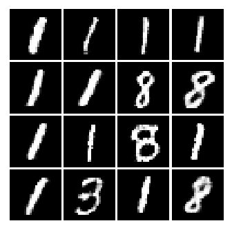
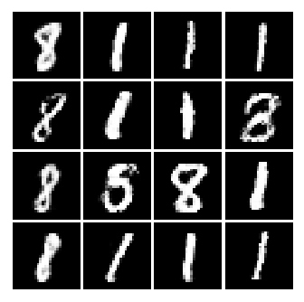

### TensorFlow-GAN: Generative Adversarial Network in TensorFlow

This is a basic GAN implementation with an aim to understand the core
concepts behind "generative models via an adversarial process".

#### Requires:

- Python (>= 3.5)
- TensorFlow (>= 1.0.1)
- NumPy
- Matplotlib

#### Outputs:

These are some of the generated images:

